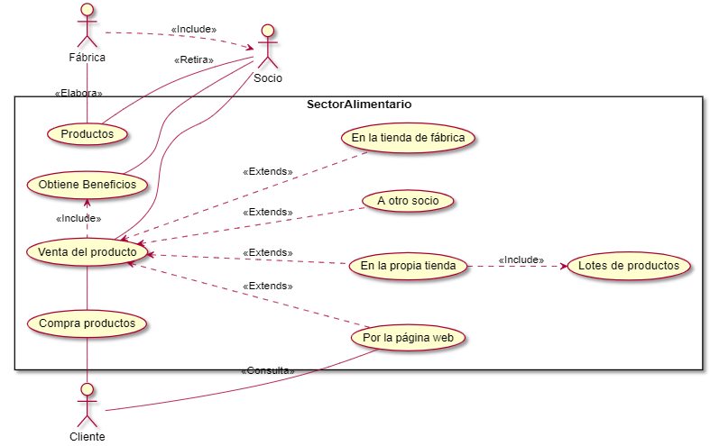
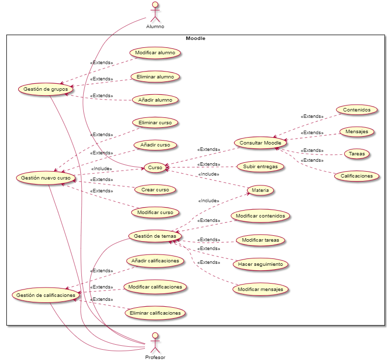

# PCV06-10

### [Ejercicio1.](https://github.com/paatrii/PCV06-10/blob/master/Ejercicio1.puml)Caso de uso fábrica embutidos

### [Ejercicio2.](https://github.com/paatrii/PCV06-10/blob/master/Ejercicio2.puml)Caso de uso moodle aula virtual

